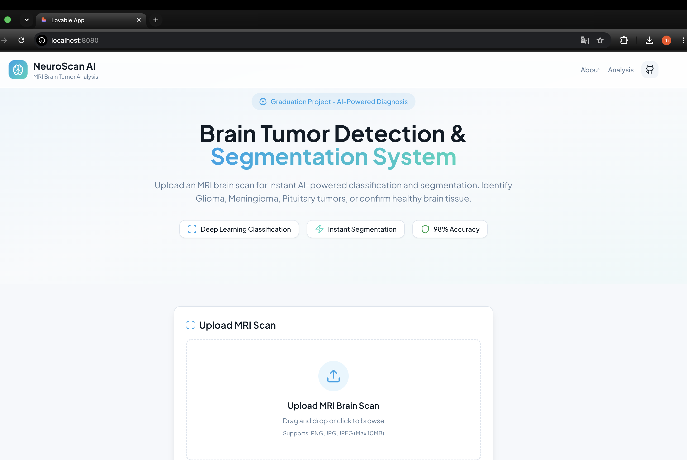
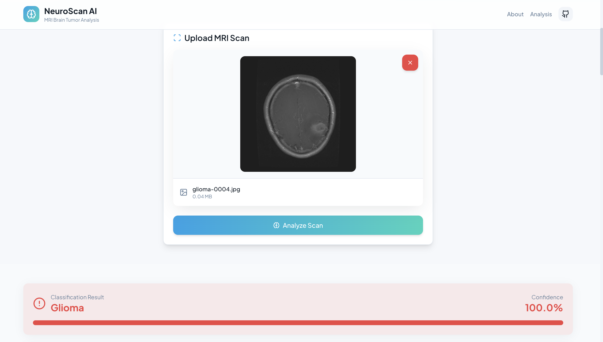
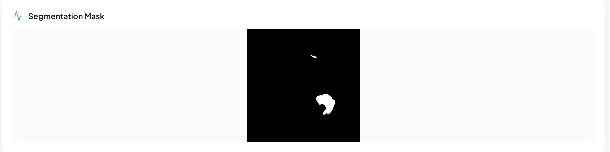
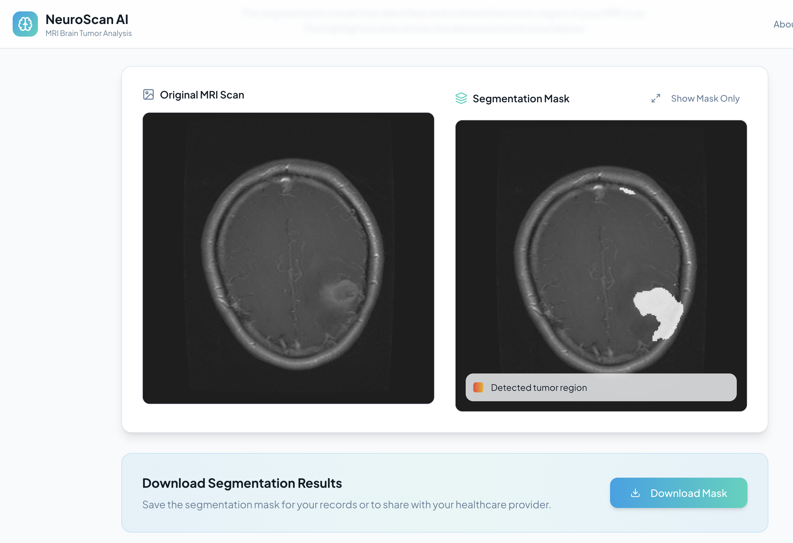
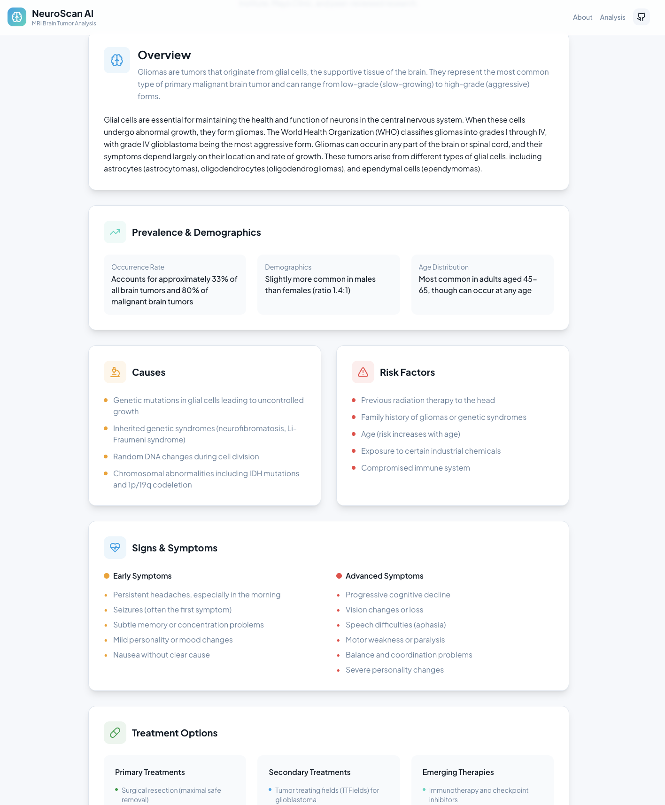
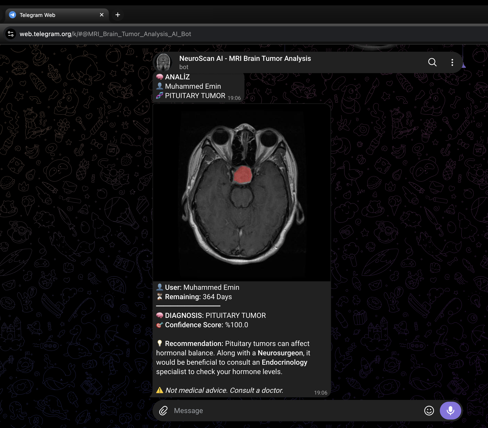
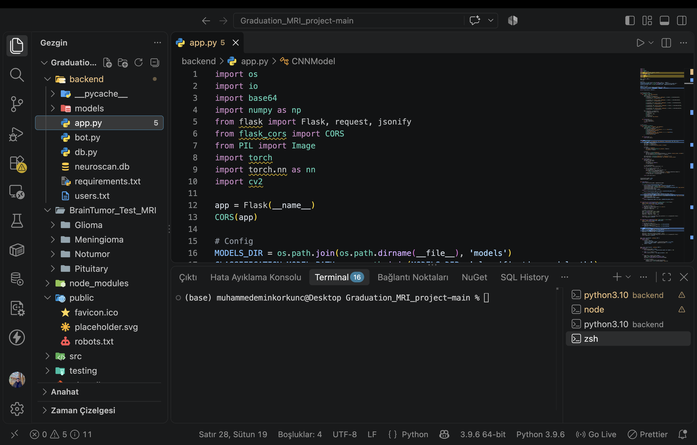

# NeuroScan AI — Brain Tumor Classification & Segmentation (MRI) 🧠⚕️

A deep learning–based medical imaging system designed to:

- **Detect and classify tumors** into **4 classes**: _Glioma, Meningioma, Pituitary, No Tumor_ with **99.03% Test Accuracy**
- **Segment tumor regions** pixel-by-pixel using a custom **U-Net** architecture with **0.87 Dice Coefficient**
- Provide an end-to-end full-stack **web platform (React + Flask)** and a companion **Telegram Bot** for real-time diagnostic workflows.

> ⚠️ **Medical Disclaimer**  
> This project is developed as an academic senior graduation thesis at Fatih Sultan Mehmet Vakıf University (2025–2026). It is intended strictly for research and educational purposes and **does not replace professional medical diagnosis**.

---

## 📑 Table of Contents

- [Demo Video](#-demo-video)
- [System Previews & Screenshots](#-system-previews--screenshots)
- [Project Summary](#project-summary)
- [Key Features](#key-features)
- [Performance & Evaluation](#-performance--evaluation)
- [Model Architectures](#model-architectures)
- [Datasets](#datasets)
- [System Architecture](#system-architecture)
- [API Endpoints](#api-endpoints)
- [Installation & Quickstart](#-installation--quickstart)
- [Project Documentation](#-project-documentation)
- [License & Intellectual Property](#-license--intellectual-property)

---

## 🎥 Demo Video

Watch the comprehensive video demonstration showing live MRI analysis, multi-class prediction, U-Net mask generation, and Telegram bot interaction:

[](https://youtu.be/zZT3-_Bz-WI)

▶️ **[Click here to watch the full demonstration on YouTube](https://youtu.be/zZT3-_Bz-WI)**

---

## 📸 System Previews & Screenshots

### 1. Web Application Landing & Scan Upload



### 2. Multi-Class Classification & Confidence Scoring



### 3. Medical Guidance & Clinical Insights



### 4. Interactive U-Net Tumor Segmentation Overlay



### 5. Detailed Metric Visualizations



### 6. Telegram Analysis Bot Integration



### 7. Core Architecture & Preprocessing Pipeline



---

## Project Summary

Manual interpretation of Brain MRI scans is labor-intensive and susceptible to fatigue-induced errors. This graduation research project addresses these limitations through a specialized two-stage pipeline:

1. **Classification (Custom CNN)**: Trained **from scratch** (without pretrained weights) across 43,687 curated MRI scans, classifying slices into _Glioma, Meningioma, Pituitary Tumor,_ and _No Tumor_.
2. **Segmentation (U-Net)**: Delivers pixel-wise binary tumor masks utilizing an encoder-decoder architecture with skip connections.

---

## Key Features

- ✅ **4-Class MRI Classification:** Exceptional reliability distinguishing three tumor types and healthy brain scans.
- ✅ **100% Healthy Patient Recall:** Zero false-negative rate on healthy scans, preventing unwarranted patient alarm.
- ✅ **Precise Pixel Localization:** U-Net trained with combined Dice + Binary Cross-Entropy loss.
- ✅ **Dual-Platform Accessibility:** Intuitive React/Vite dashboard alongside an automated Telegram Bot service.
- ✅ **Complete Documentation:** Signed academic research poster and comprehensive thesis report included.

---

## 📊 Performance & Evaluation

### Multi-Class Classification (Held-out Test Set)

| Class                | Precision  |   Recall    |  F1-Score  |  Support  |
| :------------------- | :--------: | :---------: | :--------: | :-------: |
| **Glioma**           |   98.77%   |   99.15%    |   98.96%   |   2,358   |
| **Meningioma**       |   98.73%   |   98.42%    |   98.58%   |   2,285   |
| **No Tumor**         |   99.63%   | **100.00%** | **99.82%** |   1,628   |
| **Pituitary**        |   99.17%   |   98.84%    |   99.00%   |   2,409   |
| **Weighted Average** | **99.03%** | **99.03%**  | **99.03%** | **8,680** |

### U-Net Segmentation Metrics

- **Dice Coefficient:** ~0.87
- **Intersection over Union (IoU):** ~0.78
- **Pixel Accuracy:** ~96.5%
- **Best Validation Loss:** 0.1253

---

## Model Architectures

### 1) Multi-Class Classifier (CNNModel)

- **Backbone:** 5 sequential convolutional blocks (32 → 64 → 128 → 256 → 512 channels).
- **Regularization:** Batch Normalization, progressive 2D Dropout (0.10 to 0.20), and 0.50 Fully-Connected Dropout.
- **Classification Head:** Adaptive Average Pooling `(1,1)`, Flatten, Linear (512 → 256), ReLU, Linear (256 → 4 logits).
- **Training Strategy:** Adam optimizer, ReduceLROnPlateau scheduling, and weighted CrossEntropyLoss for class balance.

### 2) Segmentation Network (U-Net)

- **Encoder:** 4 downsampling blocks (DoubleConv + MaxPool2d).
- **Bottleneck:** 1024 channels at `16×16` spatial resolution.
- **Decoder:** 4 upsampling blocks via Transposed Convolutions concatenated with skip connections.
- **Loss Formulation:** Combined Dice Loss + Binary Cross-Entropy (DiceBCELoss) for boundary refinement.

---

## Datasets

- **Classification Dataset:** 43,687 MRI slices aggregated from Figshare, Kaggle Br35H, Sartaj Bhuvaji, and Hugging Face collections (70% Train, 10% Val, 20% Test).
- **Segmentation Dataset:** The Cancer Genome Atlas LGG (Low-Grade Glioma) dataset comprising 3,929 slice-mask pairs (85% Train, 15% Validation).

---

## System Architecture

```text
[User / Radiologist]
       │
       ├── Web Dashboard (React + Vite + Tailwind CSS)
       └── Mobile Access (Telegram Bot Interface)
               │
          REST API (HTTP / JSON / Multipart)
               ▼
       [Flask Backend API]
               ├── Image Preprocessing (CLAHE, Normalization, Resizing)
               ├── Inference Engine (PyTorch CPU / CUDA)
               │      ├── Custom CNN Classifier (4-Class)
               │      └── U-Net Segmentation Engine (Binary Mask)
               └── SQLite User & Credit Database

API EndpointsMethodEndpointDescriptionGET/api/healthVerifies server readiness and returns loaded model states.POST/api/classifyAccepts multipart MRI scan; returns predicted label, confidence, and class probabilities.POST/api/segmentGenerates and returns a base64-encoded PNG binary segmentation mask.POST/api/analyzeExecutes joint classification and segmentation in a single request.

💻 Installation & Quickstart
Backend Setup

cd Graduation_MRI_project-main/backend
conda activate mri_project
pip install -r requirements.txt
python app.py

Backend runs on http://localhost:5001 or http://localhost:5000.

Frontend Setup

cd Graduation_MRI_project-main
npm install
npm run dev

Access the web interface at http://localhost:8080.

⚖️ License & Intellectual Property
Copyright (c) 2026 Muhammed Emin Korkunç. All Rights Reserved.

This project, its architectures, preprocessed models, and documentation are protected. Distributed for academic evaluation, peer review, and non-commercial educational demonstration only. Unauthorized copying, extraction, or redistribution is strictly prohibited under the terms of the project LICENSE.
```
